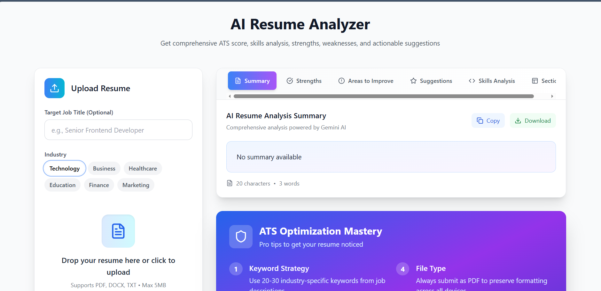

---

# 📊 AI Resume Analyzer

A smart web application that analyzes resumes and provides clear, actionable feedback to help candidates improve their chances of passing ATS (Applicant Tracking Systems).

This project combines frontend validation, backend processing, and AI-powered analysis into one complete system.

---

## 🚀 Why This Project?

Many students and freshers are unsure whether their resume is ATS-friendly.

This project solves that problem by providing:

* ✅ ATS Score (out of 100)
* 💪 Resume Strengths
* ⚠️ Areas to Improve
* 🧠 Technical & Soft Skills Detected
* 🔍 Missing Keywords
* 💡 Practical Improvement Suggestions

All displayed in a clean, easy-to-understand dashboard.

---

## 🧩 How It Works

```
Upload Resume → Extract Text → Send to Gemini AI → Receive JSON Analysis → Display Dashboard
```

### Step-by-Step Flow

1. User uploads resume (PDF).
2. Frontend validates file type and size.
3. Backend receives file using Multer.
4. Text is extracted from PDF using pdf-parse.
5. Extracted text is sent to Google Gemini API with a structured prompt.
6. Gemini returns analysis in structured JSON format.
7. Backend formats the response and deletes the temporary file.
8. Frontend displays ATS score, skills, strengths, weaknesses, and suggestions.

---

## 🤖 Gemini AI Integration

This project uses **Google Gemini** as the intelligence layer.

* API key is stored securely using environment variables (.env).
* Backend initializes the Gemini model.
* Resume text + optional job description is sent with a structured prompt.
* Gemini returns structured JSON output.
* Backend validates and sends clean response to frontend.

Model used: `gemini-2.5-flash-lite` (free tier friendly).

---

## ✨ Key Features

* 📁 Resume upload with size/type validation
* 🎯 ATS score calculation
* 🧠 Skill extraction (Technical + Soft Skills)
* ⚠️ Weakness detection & missing keywords
* 💡 Actionable suggestions
* 📊 Clean tab-based dashboard
* ⬇️ Download analysis as JSON
* 🔄 Health check & Gemini connection test endpoints

---

## 🛠️ Tech Stack

### Frontend

* ⚛️ React.js
* 🎨 Tailwind CSS
* 🔗 Axios
* 🎯 Lucide React Icons

### Backend

* 🟢 Node.js
* 🚏 Express.js
* 📤 Multer (file upload handling)
* 📖 pdf-parse (PDF text extraction)
* 🤖 @google/generative-ai (Gemini integration)

---

## 🔌 API Endpoints

| Method | Endpoint           | Description             |
| ------ | ------------------ | ----------------------- |
| POST   | `/api/analyze`     | Analyze uploaded resume |
| GET    | `/api/test`        | API health check        |
| GET    | `/api/test-gemini` | Test Gemini connection  |

---

## ⚙️ Local Setup

### 1️⃣ Clone Repository

```bash
git clone https://github.com/Simrannayak647/Ai-Resume-Analyzer.git
cd Ai-Resume-Analyzer
```

---

### 2️⃣ Backend Setup

```bash
cd backend
npm install
```

Create a `.env` file inside backend folder:

```
GEMINI_API_KEY=your_gemini_api_key_here
PORT=5000
```

Run backend:

```bash
npm start
```

---

### 3️⃣ Frontend Setup

```bash
cd ../frontend
npm install
npm start
```

---

## 🧪 How to Test

1. Open the frontend app.
2. Upload a resume (PDF).
3. Click **Analyze Resume**.
4. View ATS score, skills, strengths, weaknesses, and suggestions.

---

## 📸 Screenshot



---

## 🎥 Demo Video

Watch demo here:
[https://drive.google.com/file/d/1vme3lILkBWEvSbThg2eZr7wuUFKlGgzQ/view?usp=sharing](https://drive.google.com/file/d/1vme3lILkBWEvSbThg2eZr7wuUFKlGgzQ/view?usp=sharing)

---

## 🧠 What I Learned

* Full-stack integration (React + Node/Express)
* File upload handling using Multer
* PDF text extraction and processing
* AI API integration with structured prompts
* JSON response handling
* Error handling and fallback design
* Secure API key management

---
🙌 Built with discipline, curiosity, and zero fluff.

---
